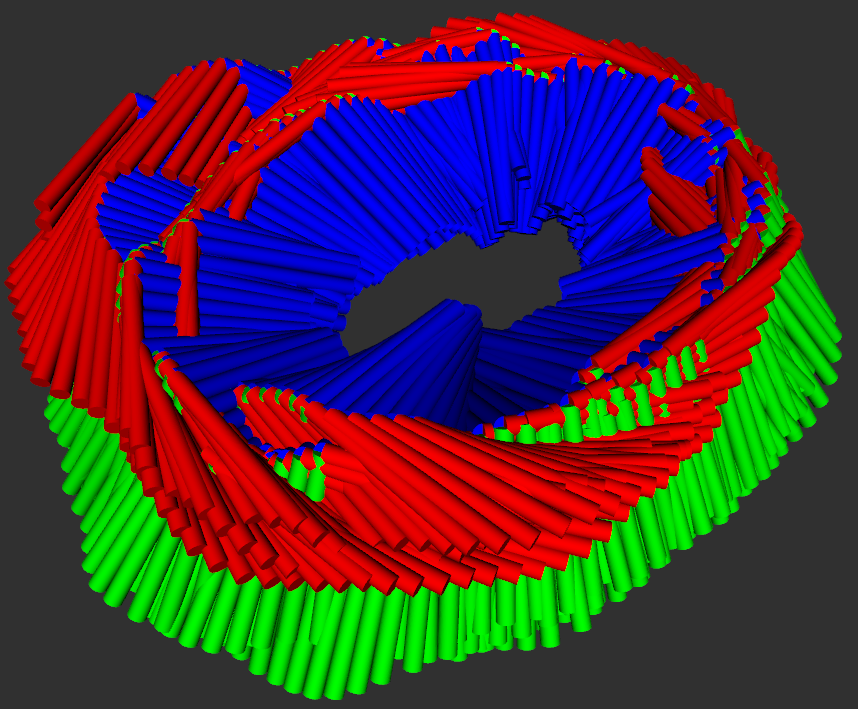

# Pose Tracking Visualization 
## [Goal] Visualize movement in rviz using a .csv & .txt file containing pose information
<td>  </td> 

**Visualized Current Pose on Trajectory**
  

**Visualized Current Pose on 3D PointCloud Map (AR Table)**
  


---
### Dependencies <br>
- ROS (test on Noetic): [ROS Installation](https://wiki.ros.org/noetic/Installation/Ubuntu)
- Pointcloud Library for ROS (test 1.7.4 version): [ros-perception-pcl](https://github.com/ros-perception/perception_pcl/releases/tag/1.7.4)

---
### Node & Topic explanation <br>
**[Node]**
- "pose_movement" Node

**[Topic]**
- "**pose**" topic
  * message type : `geometry_msgs::PoseStamped` <br>
- "**tracking**" topic
  * message type : `nav_msgs::Path` <br>
- "**odom**" topic
  * message type : `nav_msgs::Odometry` <br>
- "**full_trajectory**" topic
  * message type : `nav_msgs::Path` <br>
- "**pc_map**" topic
  * message type : `sensor_msgs::PointCloud2` <br>

**[Information]**
- header.stamp &#8658; `ros::Time::now()` (csv case) or from `timestamp` (AR table case)
- header.frame_id &#8658; `map`

**[Change Visualization Hz]**
- Change `ros::Rate loop_rate(100);` &rarr; `ros::Rate loop_rate(1000);` : 100 Hz to 1000 Hz !!
- Change `ros::Rate loop_rate(100);` &rarr; `ros::Rate loop_rate(10);` : 100 Hz to 10 Hz !!

**[Change TF Coordinate]**
- Change `transform.translation()` & `transform.rotate()` to fit origin !!

---
### Build and Run
Clone the repository and build and run simultaneously: \
```
   $ cd catkin_ws/src
   $ git clone https://github.com/SungJaeShin/pose_movement.git
   $ cd ../../
   $ catkin config -DCMAKE_BUILD_TYPE=Release
   $ catkin build pose_movement
   $ source devel/setup.bash
   $ sh start.sh
```
In `start.sh`, you must put an absolute path of GT files and Flag to visualize All trajectory at once !
```
   #!/bin/bash
   rosrun pose_movement pose_movement [pose path] [full path flag] [(Option) pointcloud map path]
```
  - **[pose path]** &rarr; Put absolute file path !!
  - **[full path flag]** &rarr; Set true (visualize) or false (not visualize) to show all trajectory at once !
  - **[pointcloud map path]** &rarr; Put absolute pointcloud (ply) file path !! (Optional Mode!!)

---
### Example
- [Case 1] csv file case
  - `498.00488,-436.80432,-4.7894874,0.55949587,-0.46982133,0.4388751,-0.52308786`
    - The example values ​​have the following meanings in turn:
      * position x = 498.00488
      * position y = -436.80432
      * position z = -4.7894874
      * orientation w = 0.55949587
      * orientation x = -0.46982133
      * orientation y = 0.4388751
      * orientation z = -0.52308786

- [Case 2] txt file case (from [AR table dataset](https://github.com/rpng/ar_table_dataset.git))
  - `1662915732.37496 2.075780 0.574562 1.116060 -0.424290 -0.670103 0.553623 0.253852`
    - The example values ​​have the following meanings in turn:
      * timestamp (sec) = 1662915732.37496
      * position x = 2.075780
      * position y = 0.574562
      * position z = 1.116060
      * orientation x = -0.424290
      * orientation y = -0.670103
      * orientation z = 0.553623
      * orientation w = 0.253852

---
### Visualization AR Table GT Results
- **Visualized All Trajectory at Once**
  <table>
    <tr>
       <td>  </td>
       <td>  </td>
    </tr>
  </table>

- **Visualized Trajectory Iteratively**
  <table>
    <tr>
       <td>  </td>
       <td>  </td>
    </tr>
  </table>

- **Visualized Current Pose on Trajectory**
  | Top View | Front View |
  |--------------|------------------|
  |  |  |

- **Visualized PointCloud Map Transformation Local to Global**
  <table>
    <tr>
       <td>  </td>
       <td>  </td>
    </tr>
  </table>


---
### Parameter explanation
- `std::ifstream file` &#8658; Variable to receive the saved CSV file <br>
- `std::vector<double> result` &#8658; Variable for converting file into std::vector with double type after removing comma(,) <br>
- `int index` &#8658; Set to distinguish because there are 7 or 8 values ​​in 1 set <br>
- `std::vector<double> array` &#8658; This is a temporary array to hold 7 or 8 values ​​and is set to publish these values ​​when all 7 or 8 are filled <br>
- `auto result_address` &#8658; Set to move to the first address value of result <br>
- `nav_msgs::Path path` &#8658; Set to output the movement path of the pose <br>
- `geometry_msgs::PoseStamped pose_track` &#8658; Set to indicate the current pose <br>
- `nav_msgs::Odometry odom` &#8658; Set to output the overall trajectory from the start point to the end <br>


---
### Function explanation
- function 1 &#8658; `parseCSVfile(std::istream &file)` & `parseTXTfile(std::istream &file)`
  - [Case 1] parseCSVfile(std::istream &file)
    -  Receive the CSV file and insert into a std::vector with a double type.
    -  In this case, the values ​​are set to be entered removed the value of comma(,).

  - [Case 2] parseTXTfile(std::istream &file)
    -  Receive the TXT file and insert into a std::vector with a double type.
    -  In this case, the values ​​are set to be entered removed the value of comma(,).
    -  Additionally, the first line contains a description of the file variable, so remove it.
  
<br>

- function 2 &#8658; `geometry_msgs::PoseStamped get_pose(~)`
   - Converts all values ​​of std::vector with double type to geometry_msgs::PoseStamped.
   - In the case of TXT file, timestamps are also put into geometry_msgs::PoseStamped.
   - In this case, it receives one line at a time and puts it into __pose_track__ inside the while statement.
  
<br>

---
### Important Thing of Publisher Latch !!
One of publisher argument "**Latch**" allows the ROS publisher to automatically transmit the last published message to the newly connected subscriber.

---
### Acknowledgement
Thank you, Gunhee Shin, for advising me on the fast message publishing method ! :)

